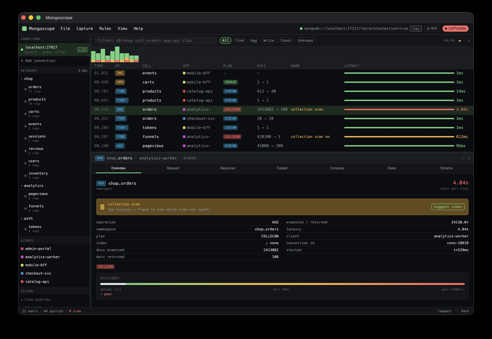

# mongoscope

> **EXPERIMENTAL - WORK IN PROGRESS**
>
> This project is in early development. Many features shown here are partially implemented. Expect rough edges, missing functionality, and breaking changes. Real MongoDB wire protocol integration is not yet complete.

---

**mongoscope** is a native desktop app for MongoDB query debugging and traffic inspection, built in Rust.

Watch every query hit your MongoDB instance in real time. Spot slow operations, collection scans, and missing indexes at a glance. Drill into the full explain plan, see what documents come back, and generate the `createIndex` command to fix the problem.



---

## Features

### Real-time query feed

A live, scrollable table of MongoDB operations as they happen. Every row shows:

- **Operation type**: `find`, `findOne`, `aggregate`, `insert`, `update`, `delete`
- **Database and collection**
- **Latency** (color-coded, with a visual bar)
- **Client app** (which service sent the query)
- **Query plan**: `IXSCAN`, `COLLSCAN`, `IDHACK` at a glance

Up to 2,000 entries kept in memory. Auto-scrolls as new operations arrive; locks scroll position when you select an entry to inspect.

A **density histogram** at the top (80 buckets) shows operation volume over time, useful for spotting traffic spikes.

### Powerful filtering

Filter the feed with a search bar that understands MongoDB context:

```
db:shop coll:orders app:checkout-svc
```

Tokens like `db:`, `coll:`, and `app:` scope results immediately. One-click preset filters for common debugging scenarios:

- **Slow queries** (operations over 1000ms)
- **COLLSCANs only** (full collection scans with no index)
- **Has suggestions** (queries where mongoscope found an index to recommend)

### Deep query inspector

Select any operation to open the inspector panel. Seven tabs:

| Tab | What it shows |
|-----|---------------|
| **Overview** | Latency, namespace, op type, key metrics |
| **Request** | The filter, pipeline, or update document as a syntax-highlighted BSON tree |
| **Response** | Returned documents |
| **Explain** | Full query plan: docs examined vs. returned, index used (or not) |
| **Compose** | Edit and re-run the query |
| **Rules** | Pattern-based rules to warn, block, or highlight matching queries |
| **Schema** | Field types, coverage %, and sample values for the collection |

The panel is resizable. Drag the divider or hit maximize for full focus.

### Index suggestions

When mongoscope detects a `COLLSCAN` or an inefficient plan, it generates a concrete index recommendation:

```js
db.orders.createIndex({ userId: 1 }, { name: "orders_userId_idx" })
```

One click to copy the shell command. The Explain tab shows a before/after comparison of what the plan would look like with the index applied.

### Connection management

Add MongoDB connections with a two-step dialog: paste the URI, give it a name and color. Multiple connections visible at once. Toggle live capture per connection. Copy the URI to point other tools at the same instance.

### Client app visibility

See which services are responsible for query load. Each client app gets a color tag. Filter the feed to a single app in one click.

### Database and collection browser

Hierarchical tree of all databases and collections, with document counts, storage sizes, and index counts. Scope the feed to a specific collection instantly.

### MCP integration

Start an MCP server from within the app (default port: 3717) and connect Claude or another AI assistant. Get a ready-to-paste config snippet. Ask questions about query patterns, get index advice, or analyze traffic with the full context of what mongoscope is seeing.

### Dark and light theme

Full dark and light mode. Toggle at any time from the toolbar.

### Compact and comfy density

Switch between compact (28px rows) and comfy (34px rows) depending on how much you want to see at once.

---

## Screenshots

_More coming soon._

---

## Building from source

Requires Rust (stable, 2021 edition).

```sh
git clone https://github.com/mongodb-labs/mongoscope
cd mongoscope
cargo build --release
./target/release/mongoscope
```

### Development

```sh
cargo fmt
cargo build
cargo test
cargo clippy
```

---

## Status

| Feature | Status |
|---------|--------|
| Query feed | 🚧 In progress |
| Filtering and search | 🚧 In progress |
| Inspector (all 7 tabs) | 🚧 In progress |
| Index suggestions | 🚧 In progress |
| Connection management | 🚧 In progress |
| Sidebar (DBs, apps, filters) | 🚧 In progress |
| MCP server integration | 🚧 In progress |
| MongoDB wire protocol capture | 🚧 In progress |
| Persistent settings | 📋 Planned |

---

## Tech stack

- **[iced 0.13](https://github.com/iced-rs/iced)** (Elm-style native UI framework for Rust)
- **tokio** (async runtime via iced's built-in integration)
- **nutype 0.5** (newtype wrappers for domain types: `QueryId`, `Timestamp`, etc.)
- **serde** (serialization for BSON documents)

---

## License

Apache 2.0 - see [LICENSE](LICENSE).

---

_Built at MongoDB Labs. Not an official MongoDB product._
